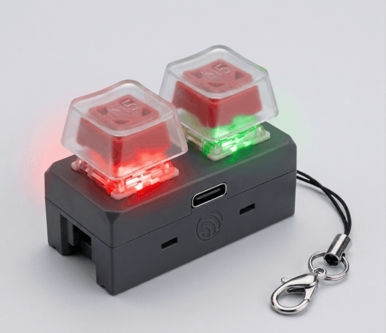
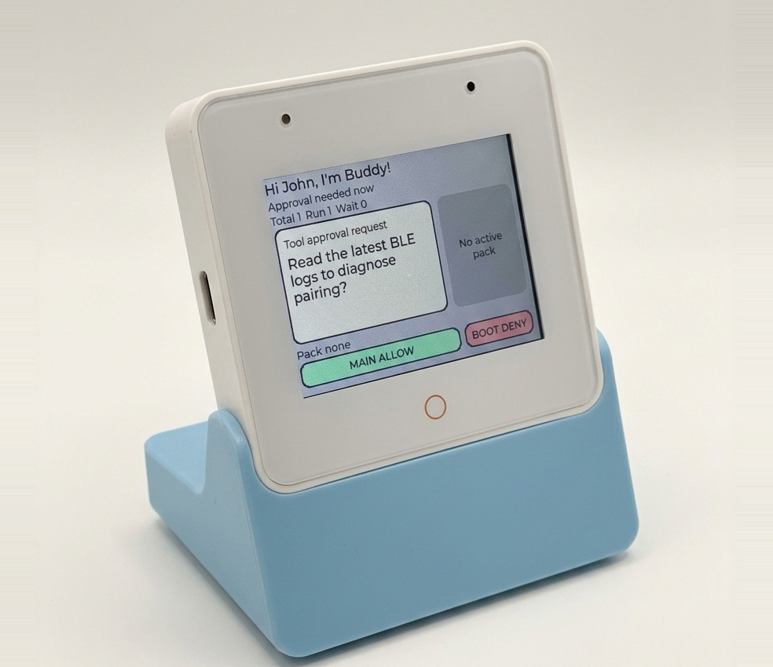

# ESP Desktop Buddy

An ESP-IDF SDK for building BLE-capable ESP32 devices for Claude Desktop Buddy.

This repository implements the [`protocol`](https://github.com/anthropics/claude-desktop-buddy/blob/main/REFERENCE.md) defined in the upstream [`claude-desktop-buddy`](https://github.com/anthropics/claude-desktop-buddy) repository.

<table>
  <tr>
    <td align="center">
      
       
      <a href="examples/m5_dualkey_headless/README.md"><strong>M5Stack Chain DualKey</strong></a>
    </td>
    <td align="center">
      
       
      <a href="examples/esp_box_3_demo/README.md"><strong>ESP32-S3-BOX-3</strong></a>
    </td>
  </tr>
</table>

Public components:

- [`esp_desktop_buddy`](components/esp_desktop_buddy/README.md): protocol core
- [`esp_desktop_buddy_transport_ble`](components/esp_desktop_buddy_transport_ble/README.md): NimBLE BLE transport
- [`esp_desktop_buddy_folder_push`](components/esp_desktop_buddy_folder_push/README.md): optional `char_*` folder-push workflow

## Start Here

- [Getting Started](docs/getting-started.md)
- [Integration](docs/integration.md)
- [Testing](docs/testing.md)
